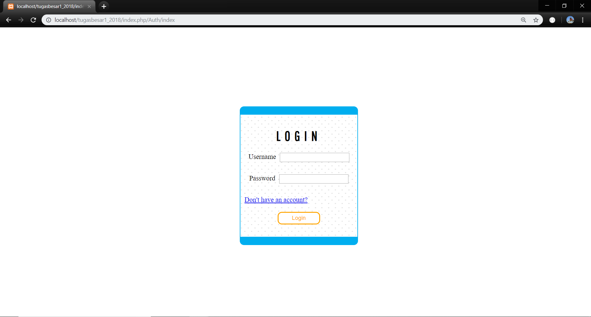
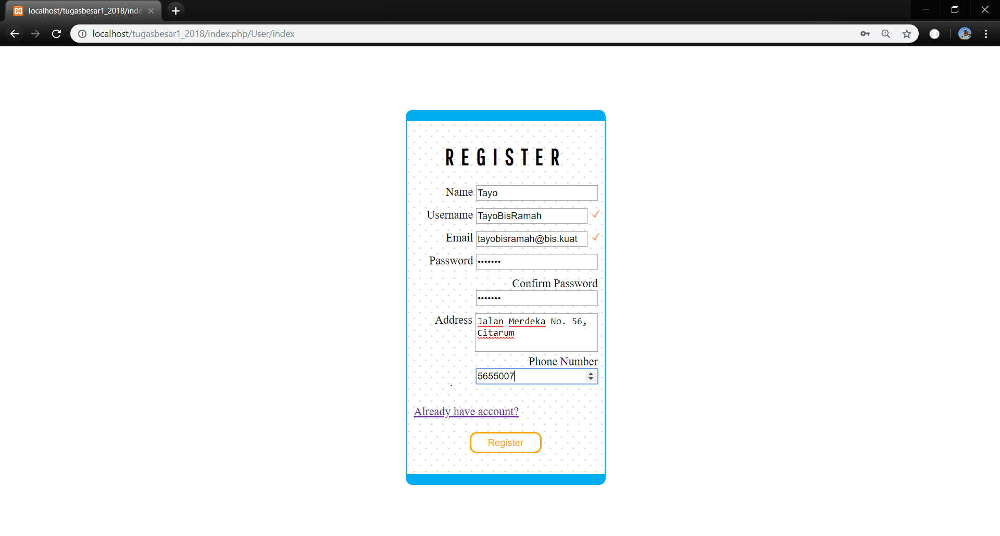
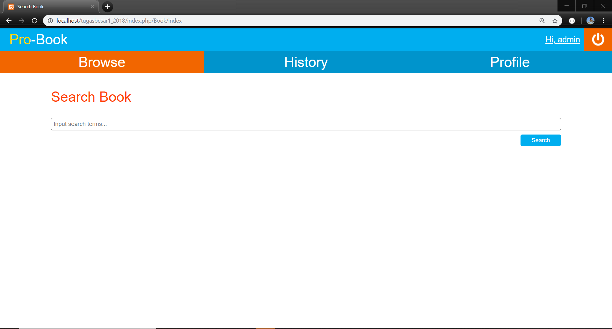
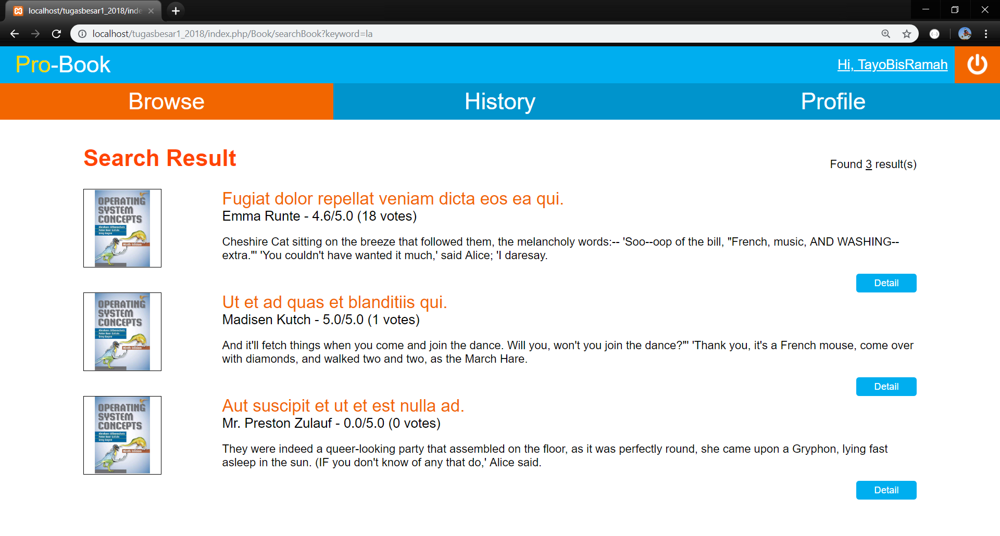
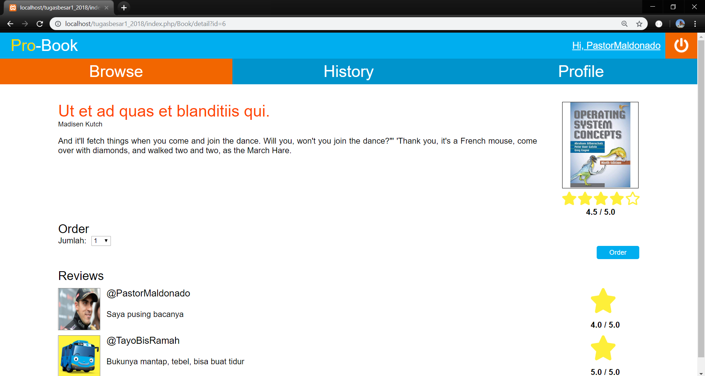
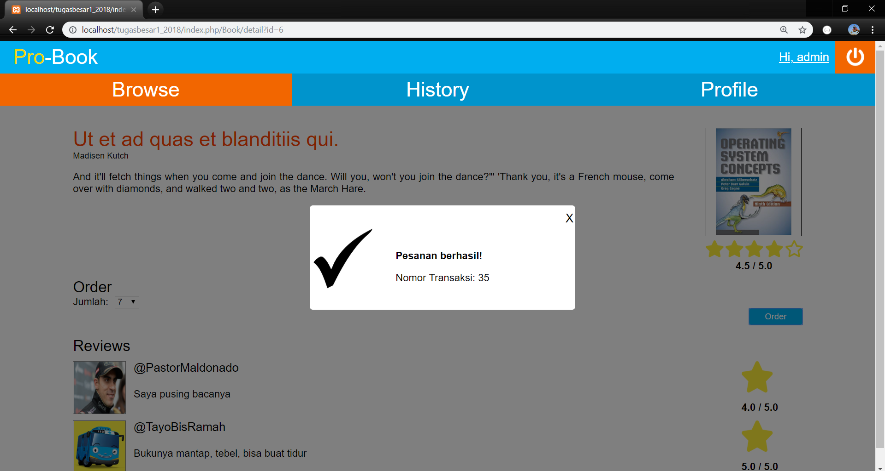
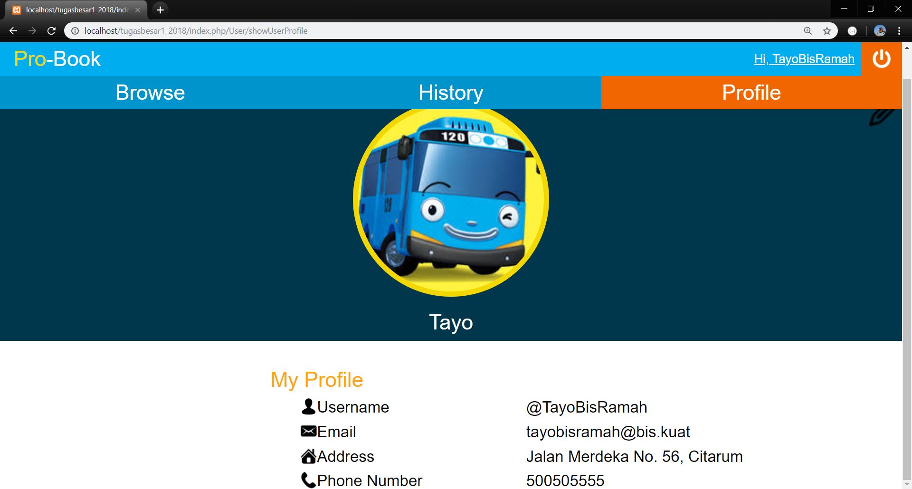
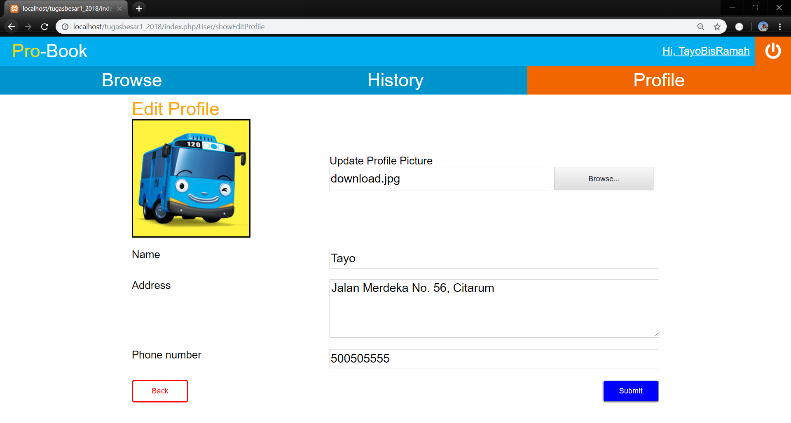
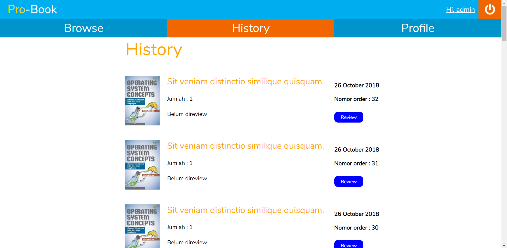
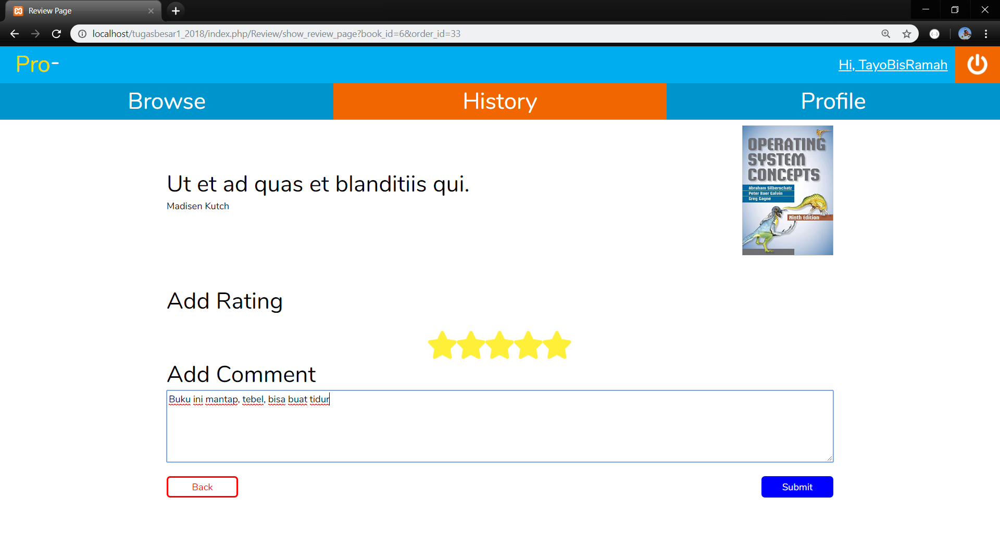

# Tugas 1 IF3110 Pengembangan Aplikasi Berbasis Web

Aplikasi Toko Buku Online berbasis web

## Anggota Tim
Ayrton Cyril - 13516019  
Muhammad Aditya Farizki - 13516082  
I Kadek Yuda Budipratama Giri - 13516115  

## Deskripsi

Aplikasi ini adalah sebuah aplikasi toko buku berbasis online di mana pengguna dapat melakukan registrasi, *login*, mencari buku, memesan buku dan memberikan *review* pada buku. Selain itu, aplikasi juga mendukung fitur berupa perubahan data pengguna.

Untuk menggunakan layanan pada aplikasi ini, pengguna diharuskan login. Apabila pengguna belum punya akun, pengguna dapat melakukan registrasi pada halaman registrasi. Data yang diisi memiliki syarat sebagai berikut:
- Setiap field pada form tidak boleh kosong.
- Email harus sesuai format email.
- Jumlah buku yang dipesan minimal 1.
- Rating buku hanya boleh bernilai 1-5.
- Nama pengguna maksimal 20 karakter.
- Nomor telepon pengguna minimal 9 digit dan maksimal 12 digit.

Setelah registrasi atau login, pengguna akan dibawa ke halaman search page.

Pada halaman search page, pengguna dapat mencari buku dengan mengetikkan keyword pada bagian input, lalu tekan Enter atau tekan tombol "Search". Setelah itu, pengguna dapat melihat buku yang ditemukan sesuai pencarian. Buku yang didapat dapat dilihat detailnya.

Detail buku berisi judul, sinopsis, gambar cover buku, dan *review* pengguna lain. Selain itu, pengguna dapat melakukan pemesanan dengan mengisi jumlahnya pada isian jumlah, lalu melakukan order dengan menekan tombol "Order". Setelah pemesanan dilakukan, akan muncul notifikasi yang memebritahukan bahwa pesanan sudah dilakukan. Notifikasi juga akan memberi tahu nomor antrian pesanan kita.

Pengguna yang sudah memesan buku dapat melihat daftar buku yang telah dipesan lewat halaman history. Pengguna dapat memberi *rating* dan komentar pada halaman review jika belum melakukannya.

Pengeditan profil dapat dilakukan pada halaman edit. Pengguna dapat mengubah foto profil, nama, alamat, dan nomor telpon.

### Spesifikasi Aplikasi
Backend : PHP7  
Frontend: HTML5, CSS3, Javascript  
Database: SQL  

## Tampilan Aplikasi

### Login

### Register

### Search Books

### Search-Result

### Book-Detail

### Profile

### Edit-Profile

### History

### Review

## Pembagian Tugas

**Tampilan**
1. Login : 13516019
2. Register : 13516019
3. Search Book: 13516115
4. Search Result: 13516115
5. Book Detail: 13516115
6. Notification: 13516082
7. Profile : 13516019 
8. Navbar : 13516082
9. Review : 13516082
10. History : 13516082

**Fungsionalitas**
1. Login : 13516019
2. Register : 13516019
3. Search Book: 13516115
4. Order Book: 13516115
5. Search Result to Book Detail: 13516115
6. Edit_profile : 13516019
7. Struktur Back-End: 13516082
8. Show user Profile :13516019
9. Review : 13516082
10. History : 13516082
11. Routing method : 13516082

